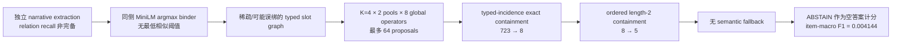

# GSCL/SCAR v2 负结果：根因审计与恢复路线

日期：2026-08-01；执行终态更新：2026-08-02

状态：`SAME_STUDY_REPAIR_EXECUTED_VALID_NEGATIVE`

recovery execution readiness：`COMPLETED_VALID`

正式负结果 commit：`4861b2d88ef7e85fb62f32e3d2e1f5c78afe9529`

正式结果：[`gscl_scar_cssm_intrinsic_formal_result_v1.json`](../manifests/gscl_scar_cssm_intrinsic_formal_result_v1.json)

适用范围：Assumption Agent reconstruction v2 的 GSCL/SCAR raw-evidence → slot graph → mapping → selector 链路

不适用范围：逐条否定 T01–T22、13 个 legacy aliases、Hegel Machine bounded old DSL 或一般意义的结构先验

本文件是对已经关闭的 protocol-valid negative result 的事后根因审计、同一 study repair 的
preregistration input 与执行终态。它不修改正式结果，也不把同一 root 重跑成正结果；新增证据仅有
已消费 cohort 上的 append-only post-hoc cross-fit authority，不具有 fresh confirmatory authority。

## 0. 直接回答：v2 可以修，但“可修”有三个不同层级

| 层级 | 当前判断 | 含义 |
|---|---|---|
| 消除 coverage collapse | **已建立** | residual/no-op 使 362/362 item 保留，361 个未选 case byte-exact fallback |
| no-op 输出与覆盖保存 | **已建立** | coverage 与 S0 相同，base/swap consistency 362/362，failure 0 |
| 总体 utility 不低于 semantic baseline | **未建立** | `U1−S0=−1/724`，冻结 lower bound 为 `−3/724` |
| 证明结构先验产生正增益 | **未建立** | 0 次正向、1 次负向 override；`U1−null=0`，但 oracle headroom 下界为正 |

因此最准确的结论是：

> v1 的 coverage failure 可以修，而且已经在同一 study lineage 的 append-only development 中修好；
> 但固定 16 维表示与 selector 没有把候选 oracle headroom 转化为净收益。被否定的是这套
> operationalization 和这次固定修复，不是 22/13 个先验整体。该 post-hoc 结果不能改写旧 formal
> `FAIL`，也不能替代 untouched confirmatory 证据；同一 362-item cohort 到此停止调参。

## 1. 对“4861b2d8 失败了什么”的精确修正

“失败的不是 22/13 个先验整体，而是一套固定 extractor/binder、硬 eligibility、length-2
composition 的 SCAR 实现”这一判断的核心边界是正确的，但还需要两点精化。

第一，**主导 coverage collapse 的不是 length-2 composition，而是 typed-incidence hard gate**：

```text
724 formal variants
  └─ flat structural 有输出：723
       └─ typed incidence 全部通过：8
            └─ ordered length-2 再通过：5
```

- typed-incidence gate 删除 `715/723 = 98.8935%`；
- length-2 gate 再删除 `3/8 = 37.5%`。

所以 composition 是次级加剧项；首要故障是把不完整、带噪的抽取图当作 closed-world exact
containment 证据，并让它拥有删除 semantic answer 的权力。

第二，SCAR formal path 的 receipt 明确记录 `formal_law_binding_count=0`。它运行的是通用
categorical slot-graph matcher，而不是逐条执行 T01–T22 的 law-specific residual。因此本轮没有
产生“22 条或 13 条逐条被否定”的证据。

## 2. 正式结果与不可改写的证据边界

### 2.1 执行有效，负结果有效

正式执行不是 infrastructure-invalid 或 protocol-invalid：systemd success、`NRestarts=0`，两份
action shard 在 label/secret barrier 前完成，offline scorer 只调用一次，online/API evaluator、
retry、replay 与 resample 均为零。391 个 item 中 29 个 ambiguous item 在 model 前 typed failure；
事前指定 primary cohort 是剩余 362 个 item 的 base/system-swap 共 724 个 variant。

唯一 confirmatory primary 是：

```text
full_with_length2_composition - semantic_only
```

paired item-macro pair-F1 mean difference 为 `-0.6728865210909416`，95% bootstrap CI 为
`[-0.7095084626852585, -0.6358874857493647]`，正式 disposition 为 `FAIL`。这个结果保持不变。

### 2.2 各 arm 的直接结果

| arm | 有输出 variants | answer coverage | item-macro pair-F1 | item-level both-variants strict exact |
|---|---:|---:|---:|---:|
| semantic-only | 724/724 | 1.000000 | 0.677030 | 0.505525 |
| flat-structural | 723/724 | 0.998619 | 0.487495 | 0.303867 |
| full no-composition | 8/724 | 0.011050 | 0.006183 | 0 |
| full + length-2 composition | 5/724 | 0.006906 | 0.004144 | 0 |
| full + composition + target-color shuffle | 7/724 | 0.009669 | 0.003453 | 0 |

full arm 的 `variant_strict_exact_rate=2/724`，即 5 个 selected variant 中只有 2 个是 variant-level
strict exact。由此还能得到一个重要结论：通过 typed incidence 与 length-2 verification 并不是
mapping 正确性的充分条件。

### 2.3 这不是 T01–T22 的逐项实验

[`gscl_slot_graph_binder_v1.py`](../assumption_agent/gscl_slot_graph_binder_v1.py) 与
[`gscl_slot_set_mapping_v1.py`](../assumption_agent/gscl_slot_set_mapping_v1.py) 的 receipt 都固定写入：

```text
formal_law_binding_count = 0
```

实际 full verifier 只检查：

1. injectivity；
2. typed local incidence；
3. ordered length-2 composition。

13 条旧假设是 22 条 UAO 的 legacy aliases，见
[`universal_assumption_ontology_v1.py`](../assumption_agent/universal_assumption_ontology_v1.py)。SCAR
source 中另有一个 `EXPECTED_DOMAIN_COUNT=13`，它是数据域数量，也不是“执行了 13 条定律”。

因此合法结论是：

```text
PROTOCOL_VALID_PRIMARY_FAIL_GENERALIZED_COUNTERPOINT_OPERATIONALIZATION_NEGATIVE
```

非法外推包括：

```text
ALL_T01_TO_T22_PRIORS_FALSIFIED
ALL_13_LEGACY_ASSUMPTIONS_FALSIFIED
STRUCTURAL_PRIORS_CANNOT_WORK
```

## 3. 失败链：结构证据怎样被逐级放大成 99.3% abstention



这条链中，“抽取图不完整”本来只应表示 unknown；当前 verifier 却会让目标图中没有观察到的
source edge/path 无法通过 eligibility。它没有签发正式的 `OBSERVED_VIOLATION`，但在 action
结果上同样排除了 proposal。再叠加无阈值的 endpoint binder、全图统一的八算子 closure 和
无 fallback 的 selector，小的抽取/绑定差异就会以合取方式被放大。

## 4. 根因分级

### 4.1 `ESTABLISHED`：由正式 aggregate、receipt 或代码直接确定

#### RC-1：typed-incidence closed-world hard eligibility 是 coverage collapse 的主因

flat structural 有输出 723/724；加入 typed incidence 后只剩 8/724。该 gate 单步删除 98.8935%
的原可选 variants。length-2 再从 8 压到 5，但不是最大的一步。

#### RC-2：没有 baseline-preserving fallback

[`gscl_slot_set_mapping_v1.py`](../assumption_agent/gscl_slot_set_mapping_v1.py) 在没有 eligible proposal
时直接返回 `ABSTAIN`；[`gscl_scar_cssm_score_v1.py`](../assumption_agent/benchmarks/gscl_scar_cssm_score_v1.py)
把 abstention 当空 proposal，unconditional pair-F1 为 0。结构不确定因此会删除 semantic answer，
而不是不改变它。

#### RC-3：仅放宽 hard gate 仍不够，结构排序质量低于 semantic backbone

flat structural 已覆盖 723/724，但 F1=`0.487495`，仍比 semantic-only 的 `0.677030` 低
`0.189536`。所以“把 strict gate 调松”不是完整修复；还必须改变结构信号的校准、排序与集成权力。

#### RC-4：hard verification 不是正确 mapping 的充分条件

full arm 通过全部 incidence/path checks 的 5 个 variant 中只有 2 个达到 variant-level strict exact。
当前 verifier 验证了有限供应图上的一致性，没有验证 mapping 的完整语义正确性。

#### RC-5：binder 强制选择唯一量化 argmax，没有最低置信阈值

[`gscl_slot_graph_binder_v1.py`](../assumption_agent/gscl_slot_graph_binder_v1.py) 对 extracted mention 与
同侧 slot label 计算 MiniLM cosine；只要量化最大值唯一就绑定，只有精确量化并列才 unbound。
receipt 明确写入 `threshold_applied=false`。

#### RC-6：输入图明确不完备，verifier 却要求 exact edge/path containment

binder 生成图时固定 `coverage_complete=false`。mapper 则要求 mapped source incidence profile 在
target profile 中完全包含，并要求所有 source length-2 paths 在 target 中出现。代码同时承认
`relation_recall_total=false`；missing observation 仍没有独立于 violation 的语义状态。

#### RC-7：SCAR formal 没有接回真正的 UAO law residual

formal law binding 数为 0；八算子 closure 只允许对全图统一做 orientation inversion、polarity
inversion 与 positional slot reversal/identity。它不能等价代表 quantity/balance/order/interaction
observable，也不能据此声称逐条测试了 T01–T22。

#### RC-8：搜索有 ceiling loss，但不是 724→5 的主因

每个 pool 只保留 `K=4`，再跨 8 个 global operators，最多产生 64 proposals。该裁剪会损失候选，
但 union 已包含 616 个 exact-gold mapping，而 hard arm 只输出 5 个；主要瓶颈仍在 gate/selector。

### 4.2 `CODE_SUPPORTED_INFERENCE`：与结果一致，但尚未被 component ablation 因果识别

1. **open-world/closed-world 合同冲突**很可能是 723→8 的核心设计错配：两侧抽取都可能漏边，
   但 exact containment 把漏观测当成不满足。
2. **无阈值 binder 很可能引入低置信误绑**：代码路径确定，但 safe result 没公开 component-level
   endpoint ground truth，无法量化 binder 占总错误的比例。
3. **四字段 closed labeling 可能放大误差**：extractor 对 kind/polarity/temporal/causal 分别给出
   闭集值，没有统一的 unknown；hard matcher 再要求四字段 exact tuple/multiset containment。
4. **八个全局 operator 对真实对应关系过于刚性**：不能做 relation-local transformation、
   law-specific missingness 或高阶 observable；但其独立贡献尚未通过 oracle operator ablation 测出。
5. **incidence containment 的单向性可能不适合 base/system-swap 对称合同**：当前检查本质是
   `source_profile - target_profile` 是否为空；是否应改为对称、coverage-aware 连续特征需要 fresh
   diagnostic，而不是在旧 root 上推断调参。
6. **raw evidence → executable law binding 的桥没有接通**：受控 law kernel 与 SCAR generic graph
   matcher 是两条不同路径，更符合现有代码事实的诊断是 bridge failure，而不是 ontology failure。
7. **K=4 可能造成次级 recall ceiling**：需要先做 pool-recall curve；在 selector 修复前盲目扩大 k
   只会增加噪声和多重比较自由度。

### 4.3 `UNKNOWN`：当前证据不能回答

1. extractor、binder、candidate generation、operator closure、selector 各自贡献了多少错误；
2. calibrated binder、soft residual 或更强 extractor 是否足以超过 semantic-only；
3. structure-only 新增的正确候选能否被 sealed selector 安全识别；
4. T05/T09/T14/T15/T17 在 fresh raw SCAR-like evidence 上是否有效；
5. 其他 T01–T22 是否适合该任务；
6. SCAR 与 WikiSQL same-v5 的差异中有多少来自 prior，而非 cohort、endpoint、candidate pool、
   fallback 或统计合同；
7. 对 downstream Agent、RAW、HippoRAG 或 Hegel Machine invention 效果的任何正向结论。

## 5. 为什么仍然存在“可恢复信号”

正式 result 的 candidate-pool diagnostics 给出：

| pool | exact-gold mapping recall | count / 724 |
|---|---:|---:|
| semantic pool | 0.798343 | 578 |
| structure pool | 0.639503 | 463 |
| structure-only added | 0.052486 | 38 |
| semantic ∪ structure | 0.850829 | 616 |

最后一行是由前面正式计数作出的集合算术：`578 + 38 = 616`。也就是说，结构 pool 并非完全
无信号；它在 semantic pool 之外增加了 38 个正确 mapping，使候选 ceiling 提高 5.2486 个百分点。
正式失败发生在系统没有能力安全地区分这 38 个增益候选与大量结构噪声，又让 hard selector
替换了 semantic backbone。

这只能支持“存在值得做 selector/recovery 实验的候选信号”，不能支持“修完一定涨分”。

另一个边界证据是
[`latest.controlled.safe.json`](../artifacts/gscl_phase0_offline_qualification_v1/latest.controlled.safe.json)：
T05/T09/T14/T15/T17 law kernel 在 25 个受控 atomic cases 上实现了 positives `10/10`、hard
negatives `10/10`、missingness abstention `5/5`。该 artifact 同时明确
`formal_result=false`、`efficacy_evidence=false`。它证明 law residual 能执行，不证明 raw-evidence
bridge 或下游效果已经有效。

## 6. successor v2 的恢复原则

### 6.1 不可变边界

1. commit `4861b2d8` 与对应 formal root 永久保持负结果；
2. 不在旧 formal root 内改文件、重启 action/scorer、replay、resample 或重写 terminal；
3. 复用同一 `GSCL_SCAR_CSSM_INTRINSIC_FORMAL_V1` 的 source、prepared input、Qwen/MiniLM
   runtime、旧 prediction/private receipt archive 与 label pack，修复产物只追加到独立
   `repair_development` root；
4. 不重跑 Qwen/MiniLM 抽取；第一轮直接复用已封存候选、graph/binder diagnostics
   与 receipt，避免重新调试 GPU/systemd 基础设施；
5. 这 362 个 primary item 的 outcome 已经打开，因此 `fresh_source=false`、
   `fresh_cohort=false`、`confirmatory_authority=false`；可以做固定 cross-fit development，
   不得称为新 sealed holdout；
6. frozen v1 arms 只保留为 failure-mode control，不再作为 trusted selector；
7. WikiSQL same-v5 只提供 minimum-commitment/no-op 的设计动机，不能作为 matched causal ablation。

### 6.2 先做 component oracle ladder，再优化模型

先在独立、可开发的 labeled diagnostic cohort 上运行以下阶梯；该 cohort 不进入后续 sealed
confirmatory score：

| 阶梯 | 输入 → 执行 | 隔离的问题 | 关键指标 |
|---|---|---|---|
| L0 | gold typed law evidence → law-specific verifier | law schema/verifier 是否正确 | positive、hard-negative、missingness disposition |
| L1 | gold typed relations（含四 attributes）+ gold endpoints → candidate/operator/selector | mapping/operator/selector ceiling | pool recall、eligible recall、selected exact |
| L2 | gold typed relations/attributes + gold spans → candidate binder → verifier | binder 独立损失 | top-1/top-k binding、margin calibration、unbound rate |
| L3 | extracted spans + oracle endpoint-to-slot binding → verifier | extractor relation损失 | relation precision/recall、typed-edge recall |
| L4 | raw extractor → candidate binder → verifier | 完整 bridge | end-to-end pool recall、eligibility、failure-code distribution |

L2 与 L3 的相对顺序不是“流水线执行顺序”，而是两个互补的 intervention：一个固定 extraction、
一个固定 binding。只有这样才能把 extractor 与 binder 的责任拆开。

每个阶梯还应按 relation family、arity、intra-/cross-side、edge color、source/target missingness 分层。
不能只报告被 selector 选中的 conditional accuracy。

### 6.3 最小代码改造

后继实现不得覆盖 v1 文件，建议使用显式新版本：

- `assumption_agent/gscl_slot_graph_binder_v2.py`
- `assumption_agent/gscl_slot_set_mapping_v2.py`
- `assumption_agent/gscl_law_residual_bridge_v1.py`
- `assumption_agent/benchmarks/gscl_scar_cssm_action_v2.py`
- `assumption_agent/benchmarks/gscl_scar_cssm_score_v2.py`
- 对应 `tests/test_*_v2.py`、design freeze、execution freeze、result 与 terminal manifests

改造顺序：

1. **三值证据语义**：`OBSERVED_MATCH / OBSERVED_VIOLATION / UNKNOWN`；目标侧未观察到 edge/path
   不得自动等价为 violation。
2. **校准 binder**：保留 top-k、absolute threshold、top1-top2 margin 与显式 abstention；所有阈值只在
   TRAIN/calibration split 冻结，不能查看 sealed outcome 后调。
3. **law-specific bridge**：先把已存在受控 kernel 的 T05/T09/T14/T15/T17 编译到 raw evidence
   bridge；为 T01–T22 发布 `REPRESENTED / PARTIAL / UNREPRESENTED` coverage matrix。
4. **semantic backbone 始终保留为可回退候选**：结构只生成 bounded residual/rerank；没有足够
   decision relevance 时，action 必须 byte-exact 等于 semantic-only。允许 override 后的总体
   non-inferiority 仍需 fresh study 证明，不能由 fallback 架构自动推出。
5. **override 需要双 gate**：结构证据自身通过校准，同时预注册的 incremental-utility selector 允许
   改变 baseline；否则 no-op。
6. **composition 先 shadow-only**：在 matched no-composition comparison 取得正增量前，length-2
   不得拥有 action 权力。
7. **最后才扩大搜索**：先画 semantic/structure/union 的 recall@k 曲线；只有诊断证明 k 是瓶颈时，
   才冻结新的 k/beam/budget。

## 7. 同一 study 的 append-only repair development

本节冻结一次后验修复开发，不创建新 study，不重跑已成功的 extractor/runtime。
使用原正式 primary census 362 items / 724 variants，base/system-swap 始终按 item 同组。
候选集、K=4 pool、八算子 closure、semantic baseline 与 gold authority 全部来自已封存
same-v1 archive；只更换 hard-delete selector 为 baseline-preserving residual selector。

### 7.1 Arms

| arm | 用途 | 是否 confirmatory |
|---|---|---|
| `S0_SEMANTIC_ONLY` | frozen semantic backbone | post-hoc matched baseline |
| `U0_UNION_SEMANTIC_RERANK` | semantic∪structure 候选，但 selector 只看 semantic 特征；隔离“只扩 candidate pool” | secondary |
| `U1_CONSERVATIVE_SOFT_STRUCTURAL` | 同一 union，加连续 structural residual/coverage/applicability；不足时 exact no-op | 唯一 primary development arm，非 confirmatory |
| `U1_NULL_PACKAGE` | 候选不变；按已冻结的 canonical color→role→sign package transform 重算 structure features | package-level mechanism diagnostic |
| `COMMON_INPUT_V1_HARD_SELECTOR` | successor common input 上复用 v1 hard-selector rule | matched failure-mode control，不等同历史 run |

在 old-language competence 还未通过前，不应把 invented-law arm混入这个 recovery study；先证明
系统能正确识别和保守使用已知 law，再进入发明新 law 的因果比较。

commit `4861b2d8` 只作为 archival historical comparator，不属于 matched arms。mapping oracle
只作 diagnostic upper bound，不进入 runtime action。第一轮 U1 不让 length-2 composition 拥有决策权；
T09 只产生 shadow receipt，不继续补 path gate。

selector 固定为 float64 ridge linear regression（截距不惩罚，`alpha=1`，SVD 闭式解），
target 是每个 proposal 相对 S0 的 base pair-F1 增量。每个 item 总训练权重为 1，
该 item 的 alternatives 均分权重；特征只用训练折的加权均值与 population SD 标准化，
SD=0 列固定为 0。预测截断到 `[-1,1]`，SVD 失败时该 outer fold 全部 no-op，不换模型重试。

特征向量严格固定为 16 维：`arity/14`、proposal semantic score 及其相对 S0 的差、
flat structural score、incidence matched ratio/total/zero-total，semantic/structure origin，
orientation/polarity/slot-reversal 三个 operator bit，以及两侧 retained-edge、dropped-edge、
unbound-endpoint 和 zero-degree 诊断。第一轮不把 verified bool、length-2、law ID 或事后
subgroup 特征加入模型。

5 个 outer folds 在 `domain_relation × arity_bucket{2,3,4,5+}` 内按冻结 digest 排序后
round-robin；inner OOF 只使用 outer-train 的其他折。threshold grid 为
`{0, 1/32, 1/16, 1/8, 1/4, ALL_NOOP}`；先满足 S0-perfect item preservation `>=0.99`，
再最大化 inner OOF exact summed delta，并列取更高 threshold；最佳净增益不严格大于 0
时固定全 no-op。

### 7.2 Primary 与 guardrails

唯一 primary development estimand 为 `U1_CONSERVATIVE_SOFT_STRUCTURAL - S0_SEMANTIC_ONLY`
的 paired unconditional item-macro pair-F1，每个 item 先平均 base/system-swap。对固定 outer-OOF
行做 100,000 次 item-cluster paired bootstrap（base/swap 不拆分，不 refit），seed
`18391702929142623763`，one-sided 95% lower bound 取排序后第 4,999 个 zero-indexed 值。
`MID=0.01`，唯一成功条件是 lower bound **严格大于** 0.01；`alpha=0.05`，只有一个
primary，不做 multiplicity correction。该区间只称 post-hoc cross-fit development interval。

必须同时满足的 guardrails：

1. 所有 item 都进入分母，任何 `ERROR` 不得借 abstention 消失；
2. answer coverage 与 S0 相同；safe no-op 设计应使其为 100%；
3. no-op cases 的输出与 S0 byte-exact 相同；
4. override 对 base/swap 联合决定，swap 必须是 base mapping 的精确逆；
5. pair-level old-success preservation `>=0.98`：分母是 S0 已正确输出的全部 gold pairs，
   分子是 U1 仍保留的这些 pairs；
6. structure override 的方向性净增益为正，并报告 positive/negative switch delta；
7. 各预注册 relation family 不以大量 abstention 换 conditional precision；
8. shuffled/role/sign controls 不产生同等增益。

执行后审计澄清：上面“必须同时满足”对第 6–8 项写得比最终 machine-readable verdict 更强。
本次实际冻结的联合判定只依次使用 implementation/integrity、pair preservation 和 primary lower bound；
方向净增益被报告且实际 FAIL，family-stratified utility 未进入 safe verdict，color/role/sign 也只作为整体
null package 而未拆成三个 arms。machine spec/runner 是执行权威；这里不把未执行项事后补成 gate，
也不声称它们通过。由于 primary 已 FAIL，这一差异不会改变终态，只限制可报告范围。

`U1 - U1_NULL_PACKAGE` 只是机制诊断，不再作为联合 pass gate。若 U1 胜 S0 但不胜
null package，最多称 `UNION_CANDIDATE_EXPANSION_EFFECT`，不得称 law-aware structural residual
有效。联合 verdict 优先级固定为：implementation/integrity invalid → preservation `<0.98`
→ primary lower bound `<=0.01` → `POSTHOC_REPAIR_DEVELOPMENT_QUALIFIED`。最后一种也不替换旧 formal
`FAIL`。

### 7.3 必报诊断

- extractor relation precision/recall 与 typed-edge recall；
- binder top-1/top-k accuracy、top1-top2 margin calibration、unbound/false-bind rate；
- retained/dropped edges、自环、zero-degree slots，以及四个 relation attribute 的分字段 macro-F1；
- semantic、structure、union 的 gold pool recall@k、oracle-best pair-F1 与 structure-only rescue rate；
- typed eligibility、composition eligibility 与各 failure code；
- selector oracle regret、selected-vs-best regret、override rate、override precision、changed-case paired delta；
- unconditional F1、coverage、strict exact、old-success preservation；
- family/arity/missingness 分层结果；
- runtime access、replay、retry、label/secret opening 与 scorer invocation receipts。

## 8. 预注册 stop rules

1. **L0 失败**：停止 raw extractor 优化；先修 law schema/verifier。
2. **同 study census 上 union oracle-best 对 semantic 的 CI 下界不大于 0**：停止 selector 路线；当前
   candidate/representation 没有 headroom，转向 extractor 或真实 law residual。
3. **gold graph 有 headroom、automatic graph 无 headroom**：停止 selector 路线，先修 extractor/binder。
4. **automatic union 有 oracle headroom、但本次固定 U1 grouped-OOF lower bound `<=0.01`**：
   该 selector 关闭；不得在这 362 items 上继续增加 threshold、k、feature 或 gate 直到成功。
   旧 runtime 可保留，但新的效果证据需要 untouched data。
5. **U1 不胜 U1_NULL_PACKAGE**：不作 law-aware structural-mechanism claim；最多保留 union candidate
   expansion 解释，但不因此否定已达到的安全修复。
6. **composition OOF 下界不大于 0**：在 v2.1 tombstone active composition，不用更多 path gate/k
   重试。
7. **guardrail 任一失败**：即使 conditional selected-case accuracy 上升，也判 conservative integration
   未资格化。
8. **append-only repair development 只执行一次**：任何有效正/负 primary 都关闭该冻结
   selector；禁止 replay、resample、redraw 或修改 threshold。
9. **没有 fresh sealed formal result**：即使后验 cross-fit 通过，也只能报告
   `POSTHOC_REPAIR_DEVELOPMENT_QUALIFIED`，不能宣称已获得新 confirmatory 正效果。

## 9. 与 WikiSQL same-v5 的关系

[`wikisql_uao_p4_study_design_v1.json`](../manifests/wikisql_uao_p4_study_design_v1.json) 与
[`same-v5 score receipt`](../manifests/wikisql_uao_p4_v5_hipporag_ext4_score_receipt_v1.json) 的任务、
候选构造、endpoint、fallback 和协议状态都与 SCAR 不同，不能把两者数值差异解释成 prior 的
matched causal effect。

WikiSQL 对 successor 设计真正有用的是：frozen no-op/minimum-commitment policy 会在证据不足时
保存 RAW；SCAR hard selector 则删除 semantic answer。可以继承的是保守集成原则，不是把 WikiSQL
的效果直接外推到 SCAR。

## 10. 对 Hegel Machine 的边界影响

该负结果不阻塞 Hegel Machine Phase-3A 的 strict identity、formal commitment 或 bounded closure；
也不改变 `OUTSIDE_FROZEN_CLOSURE(...)` 的判定合同。但它要求 Phase-3B/3C 在声称
`ONTOLOGY_DEFECT` 或“需要发明新假设”之前，先通过：

```text
OLD_LANGUAGE_IN_LANGUAGE_COMPETENCE_QUALIFIED
ONTOLOGY_DEFECT_NOT_RECOGNIZER_OR_EXTRACTOR_FAILURE
CONSERVATIVE_INTEGRATION_NO_COVERAGE_COLLAPSE
```

也就是说，v2 的失败不会让 Hegel Machine 的形式枚举失效；它会提高未来“发明是必要的、而不是
旧 law 没识别出来”的证据门槛。

## 11. 十二个修复问题的已冻结答案

本节将原先的 12 个 `NO_GO` 问题改为可执行决策。它们只授权同一 study 的
append-only post-hoc development，不授权修改旧 formal root 或签发 confirmatory verdict。

1. **U1 model 与 selector**：使用第 7 节的固定 16 维特征、float64 ridge（`alpha=1`）、
   weighted population standardization 和 5-fold nested grouped OOF。候选只来自旧 base
   `semantic_kbest ∪ structure_kbest`，不扩 k。target 为 proposal 对 S0 的 pair-F1 增量。
   候选预测并列时依次取 semantic score 更高、proposal hash 字典序更小者；
   只有预测严格高于折内冻结 threshold 才 override。schema/hash/NaN 是 invalid；
   numerical SVD failure 使该 outer fold 全 no-op，禁止换模型重试。

2. **Null package**：只保留一个 package-level diagnostic，不拆三个 effect arms。候选生成之后、
   structural feature 重算之前，对 target graph 按 `color → role → sign` 依次变换；
   用 item token、replicate、stage、relation ID 的 domain-separated SHA-256 排序，固定 32 replicates。
   color 循环移动 generator kind，role 交换前 `ceil(edge_count/2)` 条边的位置端点，sign
   循环移动 `(polarity, temporal, causal)` tuple。无效 transform 也保留，不 resample。

3. **Oracle authority**：official SCAR `mappings` 只提供 gold pair-mapping authority；extractor/binder/
   slot graph 不是 gold law authority。对 362 items 计算已封存 union 候选与 S0 中的
   oracle-best pair-F1，错误/无候选记 headroom 0；10,000 次 item bootstrap，seed
   `20260801`，MID=0。下界 `>0` 只签发 `POSTHOC_DEVELOPMENT_ORACLE_HEADROOM_PRESENT`。
   L0 固定为 T05/T09/T14/T15/T17 每类 2 positive + 2 hard-negative + 1 missingness，
   每类必须 5/5，总计必须 10/10、10/10、5/5。

4. **Cohort 与配额**：使用全部 362 primary items / 724 variants 的 census，不抽样；
   arity 计数为 2:31、3:187、4:77、5:32、6:12、7:12、8:8、9:2、10:1，domain relation
   为 intra:108、cross:254。29 ambiguous items / 58 variants 只作 robustness。当前 legitimate
   sealed confirmatory cohort 规模为 0；不从已消费 item 中伪造 holdout。

5. **Binder**：未来 raw-evidence v2 binder 固定 top-2；唯一 NFKC+casefold exact surface 可直接绑定，
   其他 endpoint 只在 top1 唯一、`s1>=tau`、`s1-s2>=mu` 时 hard bind，否则 `UNKNOWN`。
   tau/mu 只在 outer-train 的 exact-ownership anchors 上选：hard-bind precision `>=0.95`、
   全 endpoint abstention `<=0.50`，最大化正确 binding；并列按错绑更少、abstention 更少、
   mu 更大、tau 更大。无可行解时 exact-only，不放宽。当前 archive 没保留 top2 全向量，
   因此本轮 archived-selector development 不伪装重新校准 binder；只使用已封存的
   unbound/retained/dropped diagnostics。

6. **`UNKNOWN` 代数**：`M=OBSERVED_MATCH`、`V=OBSERVED_VIOLATION`、`U=UNKNOWN`。
   AND 使用 strong Kleene：任一 V 得 V，否则有 U 得 U，否则 M。穷举 OR 中任一 M 得 M；
   只在 candidate domain 已证明完备时才能由全 V 得 V；其他为 U。缺边、缺 path、endpoint
   abstention、属性缺失或抽取冲突都是 U，不是 V。U 不负分、不删 proposal。

7. **Law bridge**：只为已有受控 kernel 的 T05/T09/T14/T15/T17 保留 executable schema，
   但必须逐 law 先证明必需 observables 完整；否则标记 `PARTIAL/UNREPRESENTED`，不得把
   generic incidence/path 改名为形式 law binding。当前 SCAR categorical archive 没有 T05 的 subset
   utility folds、T14 的 finite action/vectors、T15 的 quantity ledger、T17 的 comparable values，
   也没有足够的 T09 typed map/domain authority；因此本轮这五类不获得 action authority，
   T09 composition 保持 shadow-only，其余 T01–T22 全部 `UNREPRESENTED`。

8. **Primary statistics**：使用第 7.2 节的 100,000 次固定 OOF item-cluster bootstrap、
   one-sided `alpha=0.05`、`MID=0.01`，唯一 primary，不做 multiplicity correction。coverage 必须
   逐 variant 等于 S0=1.0，pair-level old-success preservation floor 为 0.98。

9. **联合 verdict**：old-success 只冻结 pair-level primary guardrail，item/family 只报告。判定顺序是
   `REPAIR_DEVELOPMENT_IMPLEMENTATION_INVALID` →
   `REPAIR_DEVELOPMENT_UNSAFE_OLD_SUCCESS_REGRESSION` →
   `REPAIR_DEVELOPMENT_NO_PRACTICALLY_IMPORTANT_GAIN` →
   `POSTHOC_REPAIR_DEVELOPMENT_QUALIFIED`。任一缺 item、ERROR、access 越界、coverage/no-op
   mismatch 优先判 implementation-invalid。

10. **双实现**：当前不增加第二个 production extractor/recognizer，避免扩大同 cohort 自由度。
    可有独立 shadow implementation 作 L0–L4 诊断，但不参与训练、action 或 verdict。只在
    Phase-3C 要声称 ontology defect/需要发明新 law 时，才必须有独立双实现。

11. **Custody 与 authority**：不新建 study/source/cohort。同 study 新增 append-only
    `repair_development` binding，显式写入 `outcome_previously_exposed=true`、
    `formal_cohort_consumed=true`、`may_replace_parent_verdict=false`。每折可使用 operational
    late-open barrier，但不称 epistemically sealed。

12. **Roots 与版本**：分别冻结 arm、development analysis、oracle diagnostic 三个 immutable roots，
    再由 umbrella same-study binding root 绑定三者及旧 design/execution/prepared-input/formal-result。
    权威 serialization 沿用本 repo strict canonical JSON：`ensure_ascii=True`、`sort_keys=True`、
    compact separators、`allow_nan=False`；hash domain 是 body 中必填的固定字段，`self_sha256`
    按去掉自身字段的 canonical body 计算。禁止 NaN，阈值以整数比例或显式
    `ALL_NOOP` 编码。任何语义/schema 修改必须新 version/root，未知 major fail closed；
    旧 formal result 永不 migration 或重解释。

## 12. 机器可读摘要

```yaml
document_status: SAME_STUDY_REPAIR_EXECUTED_VALID_NEGATIVE
recovery_execution_readiness: COMPLETED_VALID
formal_negative_result_commit: 4861b2d88ef7e85fb62f32e3d2e1f5c78afe9529
formal_result_immutable: true
protocol_valid_negative: true
all_22_priors_tested: false
all_13_legacy_aliases_tested: false
formal_law_binding_count: 0
dominant_coverage_gate: typed_incidence_closed_world_hard_eligibility
secondary_coverage_gate: ordered_length2_composition
semantic_selected_variants: 724
flat_structural_selected_variants: 723
typed_incidence_selected_variants: 8
length2_selected_variants: 5
semantic_pool_gold_count: 578
structure_pool_gold_count: 463
structure_only_added_gold_count: 38
union_pool_gold_count_derived: 616
coverage_collapse_fixable: true
no_op_output_and_coverage_preservation_empirically_established: true
overall_semantic_baseline_noninferiority_established: false
positive_incremental_effect_established: false
repair_private_schema_qualification: PASS
repair_primary_observed_U1_minus_S0: -1/724
repair_primary_one_sided_lower_bound: -3/724
repair_override_positive_negative_zero: 0/1/361
repair_old_success_preservation: 435/436
repair_oracle_mean_headroom: 33289/130320
repair_oracle_one_sided_lower_bound: 13537/60816
repair_U1_minus_null_package: 0
exact_arm_spec_root: 54c472e73f5c19bcc9a1d80d22686e7adfdaad36846c3c683ec31a19853f18ff
statistical_verdict_spec_root: 44fc3f34a836526502ceab4491a3571082eb66ea517f2e5ff8a5389e3356ca01
null_transform_spec_root: 54c472e73f5c19bcc9a1d80d22686e7adfdaad36846c3c683ec31a19853f18ff
oracle_predicate_spec_root: cd32aa597b397507c90449e18db05ff42024e94da8d232e45aa6a3b0151d83e4
continuation_binding_root: d016b9d6437ae220262ad69dcb6acb3cf7baa82f41d7f73fba0bed218161b43b
repair_result_root: 86ce5455fd0158ec13fac9c9ce5e39d7bd68409ffca15af00f2621b11e3414d8
same_root_retuning_or_replay_allowed: false
next_required_action: STOP_SAME_COHORT_SELECTOR_TUNING;_CONTINUE_ONLY_WITH_UNTOUCHED_DATA_AND_LAW_OBSERVABLES
```

## 13. 同一 study repair 的执行终态

本计划已经按第 11 节的 12 个答案执行完毕，不再只是路线图。第一次
`same_study_repair_v2` 在读取两份既有 private pack 后、任何 pair-F1、fit、OOF、threshold、bootstrap
或 result 之前，以 `SCAR_REPAIR_GOLD_INVALID` 退出。独立聚合审计确认 362/362 个 primary gold
mapping 都是合法的无序集合双射，system-swap 也全部是精确逆；只有 51/362 个 base 和 57/362 个
swap 的列表顺序偶然与 slot wire order 相同。因此旧 attempt 永久封存为
`implementation-invalid / zero-effect`，没有被改写成效果结果。

经用户明确授权后，仍沿用 `GSCL_SCAR_CSSM_INTRINSIC_FORMAL_V1`，只追加一次 parser continuation。
唯一允许的机械改动是把 gold 的验证从“列表左端点必须按 slot 顺序排列”改为“左右端点集合各自完备、
pair 无重复，并且 swap 是 base 的精确逆”；prediction、candidate、16 维特征、ridge、fold、threshold、
metric、seed、bootstrap 和 verdict 均未改变。正式执行前，同一个冻结 runner 的 private-schema-only CLI
资格化得到 `PASS`：prediction/label pack 各读一次，effect target、pair-F1、fold、fit、threshold、oracle、
bootstrap、aggregate、attempt 和 output 均为 0。

continuation 的唯一正式 invocation 为 `f9b07d1abc3f47ccb900e3d23b95dc07`，启动/结束于
`2026-08-02 06:48:26.837489 / 06:49:51.921148 CST`；systemd success、`NRestarts=0`、
`ExecMainStatus=0`，无 swap，CPU time `1min 25.056s`。远端结果 root 只含 mode `0600` 的 attempt、
private result 和 safe result 三个文件；root mode 为 `0700`，三份 self-seal、交叉 binding 与 exact
file set 均通过离线复核。私有 362 条 record 继续只留 311linux。

结果把“安全集成”和“正向效果”清楚分开了：

| 项目 | exact 结果 | 判定 |
|---|---:|---|
| `S0` mean pair-F1 | `308807/456120 = 0.677030` | 冻结 semantic baseline |
| `U0` mean pair-F1 / override | `308807/456120` / `0` | candidate union 本身没有触发收益 |
| `U1` mean pair-F1 / override | `308177/456120` / `1` | 唯一 override 为负向 |
| `U1−S0` observed / one-sided lower bound | `−1/724` / `−3/724` | 未达到 `LB > 0.01` |
| positive / negative / zero switch | `0 / 1 / 361` | selector 未识别出有益 switch |
| old-success preservation | `435/436 = 0.997706` | 通过 `0.98` guardrail |
| `U1−U1_NULL_PACKAGE` | `0` | 没有 law-aware package 增量证据 |
| mapping-oracle headroom / lower bound | `33289/130320` / `13537/60816` | 固定候选池存在显著上限空间 |

这里不能写成“除 primary 外所有 guardrail 均通过”：方向净增益 guardrail 实际为 FAIL；family-stratified
coverage/utility 没有进入 safe verdict；冻结设计只报告整体 null package，而没有分别运行 color/role/sign
三个 shuffle arm。primary 已失败，足以按 stop rule 关闭 selector，这些未报告的 secondary 项不可能把
FAIL 救回 PASS，但其缺失必须保留为报告边界。

所以 hard gate 的 coverage collapse 已经修好：362/362 item 都保留，361 个 no-op byte-exact，
base/swap consistency 为 362/362，numerical failure 为 0。但这没有把结构信号变成可用收益；冻结的
16 维特征与 nested cross-fit selector 只做了一次错误 override。与此同时 oracle F1 达
`850637/912240 = 0.932471`，headroom 下界约 `0.222589`，说明主要瓶颈不是候选完全缺失，而是
**现有表示无法在不看答案时识别那批结构独有的正确 mapping**。

本结果不逐条检验 T01–T22 或 13 个 legacy alias：本轮 law-specific action authority 仍为 0，
`U1−null=0` 也不允许作 law-aware 正向主张。它能支持的论文结论是：baseline-preserving residual
足以消除 hard-gate coverage 风险，冻结候选池确有结构 headroom，但当前通用 incidence/binder
features 不能把 headroom 转化为稳定 utility。依据事前 stop rule，不得继续在这 362 个已消费 item
上增加 feature、threshold、k 或 gate；若继续科学主线，只能使用 untouched data，并先让可观测量真正
支持具体 law residual，而不是再调同一 selector。

安全终态见
[`parser-continuation result`](../manifests/gscl_scar_cssm_same_study_repair_parser_continuation_r1_result_v2.json)，
其 result self SHA-256 为 `86ce5455…14d8`；冻结 binding、amendment 与 runner 分别见附录 A。

## 附录 A：直接证据索引

- 正式设计与执行：
  [`design freeze`](../manifests/gscl_scar_cssm_intrinsic_formal_design_freeze_v1.json)；
  [`execution freeze`](../manifests/gscl_scar_cssm_intrinsic_execution_freeze_v1.json)；
  [`prepared input binding`](../manifests/gscl_scar_cssm_intrinsic_prepared_input_binding_v1.json)；
  [`source-free qualification`](../manifests/gscl_scar_cssm_source_free_runtime_qualification_result_v1.json)；
  [`representation-recovery amendment`](../manifests/gscl_scar_cssm_intrinsic_representation_recovery_protocol_amendment_v1.json)；
  [`formal result`](../manifests/gscl_scar_cssm_intrinsic_formal_result_v1.json)；
  [`same-study repair arm spec`](../manifests/gscl_scar_cssm_same_study_repair_arm_spec_v2.json)；
  [`same-study repair analysis spec`](../manifests/gscl_scar_cssm_same_study_repair_development_analysis_spec_v2.json)；
  [`same-study repair oracle spec`](../manifests/gscl_scar_cssm_same_study_repair_oracle_diagnostic_v2.json)；
  [`parser-continuation amendment`](../manifests/gscl_scar_cssm_same_study_repair_parser_continuation_amendment_r1_v2.json)；
  [`parser-continuation binding`](../manifests/gscl_scar_cssm_same_study_repair_parser_continuation_r1_binding_v2.json)；
  [`parser-continuation result`](../manifests/gscl_scar_cssm_same_study_repair_parser_continuation_r1_result_v2.json)。
- 实现：
  [`action`](../assumption_agent/benchmarks/gscl_scar_cssm_action_v1.py)；
  [`binder`](../assumption_agent/gscl_slot_graph_binder_v1.py)；
  [`mapping/selector`](../assumption_agent/gscl_slot_set_mapping_v1.py)；
  [`scorer`](../assumption_agent/benchmarks/gscl_scar_cssm_score_v1.py)；
  [`repair contract`](../assumption_agent/gscl_scar_cssm_repair_contract_v2.py)；
  [`repair mechanisms`](../assumption_agent/gscl_scar_cssm_repair_mechanisms_v2.py)；
  [`parser-continuation runner`](../assumption_agent/benchmarks/gscl_scar_cssm_same_study_repair_parser_continuation_r1_v2.py)。
- 受控 law-kernel 边界证据：
  [`latest.controlled.safe.json`](../artifacts/gscl_phase0_offline_qualification_v1/latest.controlled.safe.json)。
- WikiSQL 非 matched 对照：
  [`study design`](../manifests/wikisql_uao_p4_study_design_v1.json)；
  [`score receipt`](../manifests/wikisql_uao_p4_v5_hipporag_ext4_score_receipt_v1.json)；
  [`continuation terminal`](../manifests/wikisql_uao_p4_v5_hipporag_ext4_continuation_terminal_v1.json)；
  [`validation receipt`](../manifests/wikisql_uao_p4_v5_hipporag_ext4_validation_receipt_v1.json)。

## 附录 B：证据版本

- `924866bac31bfb548667f942060da7380cad5c61`：SCAR design freeze；
- `afcda7980f9e9164029777791ecb122c5a508161`：SCAR execution freeze；
- `5c910c256dd0e49f56b744ae8306c904e7b438b2`：same-v1 representation recovery；
- `da701bea2a3b248a1abb96d93d7e3b379d593cec`：source-free runtime qualification；
- `4861b2d88ef7e85fb62f32e3d2e1f5c78afe9529`：protocol-valid formal negative result。
