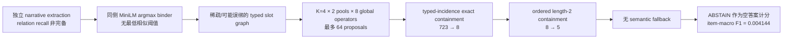

# GSCL/SCAR v2 负结果：根因审计与恢复路线

日期：2026-08-01

状态：`SUCCESSOR_REPAIR_PLAN_NOT_RETROSPECTIVE_RESCUE`

recovery execution readiness：`NO_GO_EXACT_FREEZE_REQUIRED`

正式负结果 commit：`4861b2d88ef7e85fb62f32e3d2e1f5c78afe9529`

正式结果：[`gscl_scar_cssm_intrinsic_formal_result_v1.json`](../manifests/gscl_scar_cssm_intrinsic_formal_result_v1.json)

适用范围：Assumption Agent reconstruction v2 的 GSCL/SCAR raw-evidence → slot graph → mapping → selector 链路

不适用范围：逐条否定 T01–T22、13 个 legacy aliases、Hegel Machine bounded old DSL 或一般意义的结构先验

本文件是对已经关闭的 protocol-valid negative result 的事后根因审计，以及后继版本的
repair preregistration input。它不修改正式结果、不把同一 root 重跑成正结果，也不构成新的效果证据。

## 0. 直接回答：v2 可以修，但“可修”有三个不同层级

| 层级 | 当前判断 | 含义 |
|---|---|---|
| 消除 coverage collapse | **可以，工程上已定位** | 保留 semantic backbone、把结构改为 residual/no-op，并区分 unknown 与 violated，可避免 724→5 的硬删除 |
| no-op 输出与覆盖保存 | **可以按架构保证** | 结构证据未达到冻结 gate 时 byte-exact fallback；不能再用 abstention 删除已有 semantic answer |
| 总体 utility 不低于 semantic baseline | **尚未建立** | 一旦允许 structural override，错误 switch 仍可能降分；必须由 fresh matched non-inferiority guardrail 证明 |
| 证明结构先验产生正增益 | **未知，必须 fresh study** | 当前结构 pool 有少量独有正确候选，但 selector 能否可靠识别它们尚未证明 |

因此最准确的结论是：

> v2 没有被证明不可救。被正式否定的是一套没有真正执行 UAO law binding、又把不完整
> 结构证据接入 closed-world hard selector 的 SCAR v1 operationalization。已定位的失效机制
> 可以在 successor 版本中修复；修复后能否超过 semantic-only，只能由新版本、新 cohort、
> 新 sealed split 的正式测量回答。

## 1. 对“4861b2d8 失败了什么”的精确修正

“失败的不是 22/13 个先验整体，而是一套固定 extractor/binder、硬 eligibility、length-2
composition 的 SCAR 实现”这一判断的核心边界是正确的，但还需要两点精化。

第一，**主导 coverage collapse 的不是 length-2 composition，而是 typed-incidence hard gate**：

```text
724 formal variants
  └─ flat structural 有输出：723
       └─ typed incidence 全部通过：8
            └─ ordered length-2 再通过：5
```

- typed-incidence gate 删除 `715/723 = 98.8935%`；
- length-2 gate 再删除 `3/8 = 37.5%`。

所以 composition 是次级加剧项；首要故障是把不完整、带噪的抽取图当作 closed-world exact
containment 证据，并让它拥有删除 semantic answer 的权力。

第二，SCAR formal path 的 receipt 明确记录 `formal_law_binding_count=0`。它运行的是通用
categorical slot-graph matcher，而不是逐条执行 T01–T22 的 law-specific residual。因此本轮没有
产生“22 条或 13 条逐条被否定”的证据。

## 2. 正式结果与不可改写的证据边界

### 2.1 执行有效，负结果有效

正式执行不是 infrastructure-invalid 或 protocol-invalid：systemd success、`NRestarts=0`，两份
action shard 在 label/secret barrier 前完成，offline scorer 只调用一次，online/API evaluator、
retry、replay 与 resample 均为零。391 个 item 中 29 个 ambiguous item 在 model 前 typed failure；
事前指定 primary cohort 是剩余 362 个 item 的 base/system-swap 共 724 个 variant。

唯一 confirmatory primary 是：

```text
full_with_length2_composition - semantic_only
```

paired item-macro pair-F1 mean difference 为 `-0.6728865210909416`，95% bootstrap CI 为
`[-0.7095084626852585, -0.6358874857493647]`，正式 disposition 为 `FAIL`。这个结果保持不变。

### 2.2 各 arm 的直接结果

| arm | 有输出 variants | answer coverage | item-macro pair-F1 | item-level both-variants strict exact |
|---|---:|---:|---:|---:|
| semantic-only | 724/724 | 1.000000 | 0.677030 | 0.505525 |
| flat-structural | 723/724 | 0.998619 | 0.487495 | 0.303867 |
| full no-composition | 8/724 | 0.011050 | 0.006183 | 0 |
| full + length-2 composition | 5/724 | 0.006906 | 0.004144 | 0 |
| full + composition + target-color shuffle | 7/724 | 0.009669 | 0.003453 | 0 |

full arm 的 `variant_strict_exact_rate=2/724`，即 5 个 selected variant 中只有 2 个是 variant-level
strict exact。由此还能得到一个重要结论：通过 typed incidence 与 length-2 verification 并不是
mapping 正确性的充分条件。

### 2.3 这不是 T01–T22 的逐项实验

[`gscl_slot_graph_binder_v1.py`](../assumption_agent/gscl_slot_graph_binder_v1.py) 与
[`gscl_slot_set_mapping_v1.py`](../assumption_agent/gscl_slot_set_mapping_v1.py) 的 receipt 都固定写入：

```text
formal_law_binding_count = 0
```

实际 full verifier 只检查：

1. injectivity；
2. typed local incidence；
3. ordered length-2 composition。

13 条旧假设是 22 条 UAO 的 legacy aliases，见
[`universal_assumption_ontology_v1.py`](../assumption_agent/universal_assumption_ontology_v1.py)。SCAR
source 中另有一个 `EXPECTED_DOMAIN_COUNT=13`，它是数据域数量，也不是“执行了 13 条定律”。

因此合法结论是：

```text
PROTOCOL_VALID_PRIMARY_FAIL_GENERALIZED_COUNTERPOINT_OPERATIONALIZATION_NEGATIVE
```

非法外推包括：

```text
ALL_T01_TO_T22_PRIORS_FALSIFIED
ALL_13_LEGACY_ASSUMPTIONS_FALSIFIED
STRUCTURAL_PRIORS_CANNOT_WORK
```

## 3. 失败链：结构证据怎样被逐级放大成 99.3% abstention



这条链中，“抽取图不完整”本来只应表示 unknown；当前 verifier 却会让目标图中没有观察到的
source edge/path 无法通过 eligibility。它没有签发正式的 `OBSERVED_VIOLATION`，但在 action
结果上同样排除了 proposal。再叠加无阈值的 endpoint binder、全图统一的八算子 closure 和
无 fallback 的 selector，小的抽取/绑定差异就会以合取方式被放大。

## 4. 根因分级

### 4.1 `ESTABLISHED`：由正式 aggregate、receipt 或代码直接确定

#### RC-1：typed-incidence closed-world hard eligibility 是 coverage collapse 的主因

flat structural 有输出 723/724；加入 typed incidence 后只剩 8/724。该 gate 单步删除 98.8935%
的原可选 variants。length-2 再从 8 压到 5，但不是最大的一步。

#### RC-2：没有 baseline-preserving fallback

[`gscl_slot_set_mapping_v1.py`](../assumption_agent/gscl_slot_set_mapping_v1.py) 在没有 eligible proposal
时直接返回 `ABSTAIN`；[`gscl_scar_cssm_score_v1.py`](../assumption_agent/benchmarks/gscl_scar_cssm_score_v1.py)
把 abstention 当空 proposal，unconditional pair-F1 为 0。结构不确定因此会删除 semantic answer，
而不是不改变它。

#### RC-3：仅放宽 hard gate 仍不够，结构排序质量低于 semantic backbone

flat structural 已覆盖 723/724，但 F1=`0.487495`，仍比 semantic-only 的 `0.677030` 低
`0.189536`。所以“把 strict gate 调松”不是完整修复；还必须改变结构信号的校准、排序与集成权力。

#### RC-4：hard verification 不是正确 mapping 的充分条件

full arm 通过全部 incidence/path checks 的 5 个 variant 中只有 2 个达到 variant-level strict exact。
当前 verifier 验证了有限供应图上的一致性，没有验证 mapping 的完整语义正确性。

#### RC-5：binder 强制选择唯一量化 argmax，没有最低置信阈值

[`gscl_slot_graph_binder_v1.py`](../assumption_agent/gscl_slot_graph_binder_v1.py) 对 extracted mention 与
同侧 slot label 计算 MiniLM cosine；只要量化最大值唯一就绑定，只有精确量化并列才 unbound。
receipt 明确写入 `threshold_applied=false`。

#### RC-6：输入图明确不完备，verifier 却要求 exact edge/path containment

binder 生成图时固定 `coverage_complete=false`。mapper 则要求 mapped source incidence profile 在
target profile 中完全包含，并要求所有 source length-2 paths 在 target 中出现。代码同时承认
`relation_recall_total=false`；missing observation 仍没有独立于 violation 的语义状态。

#### RC-7：SCAR formal 没有接回真正的 UAO law residual

formal law binding 数为 0；八算子 closure 只允许对全图统一做 orientation inversion、polarity
inversion 与 positional slot reversal/identity。它不能等价代表 quantity/balance/order/interaction
observable，也不能据此声称逐条测试了 T01–T22。

#### RC-8：搜索有 ceiling loss，但不是 724→5 的主因

每个 pool 只保留 `K=4`，再跨 8 个 global operators，最多产生 64 proposals。该裁剪会损失候选，
但 union 已包含 616 个 exact-gold mapping，而 hard arm 只输出 5 个；主要瓶颈仍在 gate/selector。

### 4.2 `CODE_SUPPORTED_INFERENCE`：与结果一致，但尚未被 component ablation 因果识别

1. **open-world/closed-world 合同冲突**很可能是 723→8 的核心设计错配：两侧抽取都可能漏边，
   但 exact containment 把漏观测当成不满足。
2. **无阈值 binder 很可能引入低置信误绑**：代码路径确定，但 safe result 没公开 component-level
   endpoint ground truth，无法量化 binder 占总错误的比例。
3. **四字段 closed labeling 可能放大误差**：extractor 对 kind/polarity/temporal/causal 分别给出
   闭集值，没有统一的 unknown；hard matcher 再要求四字段 exact tuple/multiset containment。
4. **八个全局 operator 对真实对应关系过于刚性**：不能做 relation-local transformation、
   law-specific missingness 或高阶 observable；但其独立贡献尚未通过 oracle operator ablation 测出。
5. **incidence containment 的单向性可能不适合 base/system-swap 对称合同**：当前检查本质是
   `source_profile - target_profile` 是否为空；是否应改为对称、coverage-aware 连续特征需要 fresh
   diagnostic，而不是在旧 root 上推断调参。
6. **raw evidence → executable law binding 的桥没有接通**：受控 law kernel 与 SCAR generic graph
   matcher 是两条不同路径，更符合现有代码事实的诊断是 bridge failure，而不是 ontology failure。
7. **K=4 可能造成次级 recall ceiling**：需要先做 pool-recall curve；在 selector 修复前盲目扩大 k
   只会增加噪声和多重比较自由度。

### 4.3 `UNKNOWN`：当前证据不能回答

1. extractor、binder、candidate generation、operator closure、selector 各自贡献了多少错误；
2. calibrated binder、soft residual 或更强 extractor 是否足以超过 semantic-only；
3. structure-only 新增的正确候选能否被 sealed selector 安全识别；
4. T05/T09/T14/T15/T17 在 fresh raw SCAR-like evidence 上是否有效；
5. 其他 T01–T22 是否适合该任务；
6. SCAR 与 WikiSQL same-v5 的差异中有多少来自 prior，而非 cohort、endpoint、candidate pool、
   fallback 或统计合同；
7. 对 downstream Agent、RAW、HippoRAG 或 Hegel Machine invention 效果的任何正向结论。

## 5. 为什么仍然存在“可恢复信号”

正式 result 的 candidate-pool diagnostics 给出：

| pool | exact-gold mapping recall | count / 724 |
|---|---:|---:|
| semantic pool | 0.798343 | 578 |
| structure pool | 0.639503 | 463 |
| structure-only added | 0.052486 | 38 |
| semantic ∪ structure | 0.850829 | 616 |

最后一行是由前面正式计数作出的集合算术：`578 + 38 = 616`。也就是说，结构 pool 并非完全
无信号；它在 semantic pool 之外增加了 38 个正确 mapping，使候选 ceiling 提高 5.2486 个百分点。
正式失败发生在系统没有能力安全地区分这 38 个增益候选与大量结构噪声，又让 hard selector
替换了 semantic backbone。

这只能支持“存在值得做 selector/recovery 实验的候选信号”，不能支持“修完一定涨分”。

另一个边界证据是
[`latest.controlled.safe.json`](../artifacts/gscl_phase0_offline_qualification_v1/latest.controlled.safe.json)：
T05/T09/T14/T15/T17 law kernel 在 25 个受控 atomic cases 上实现了 positives `10/10`、hard
negatives `10/10`、missingness abstention `5/5`。该 artifact 同时明确
`formal_result=false`、`efficacy_evidence=false`。它证明 law residual 能执行，不证明 raw-evidence
bridge 或下游效果已经有效。

## 6. successor v2 的恢复原则

### 6.1 不可变边界

1. commit `4861b2d8` 与对应 formal root 永久保持负结果；
2. 禁止在已消费 root 上改 gate、调 threshold、重跑或挑选有利 subgroup；
3. 所有修改使用新 source version、新 manifests、新 cohort 与独立 sealed split；
4. frozen v1 arms 只保留为 failure-mode control，不再作为 trusted selector；
5. WikiSQL same-v5 只提供 minimum-commitment/no-op 的设计动机，不能作为 matched causal ablation。

### 6.2 先做 component oracle ladder，再优化模型

先在独立、可开发的 labeled diagnostic cohort 上运行以下阶梯；该 cohort 不进入后续 sealed
confirmatory score：

| 阶梯 | 输入 → 执行 | 隔离的问题 | 关键指标 |
|---|---|---|---|
| L0 | gold typed law evidence → law-specific verifier | law schema/verifier 是否正确 | positive、hard-negative、missingness disposition |
| L1 | gold typed relations（含四 attributes）+ gold endpoints → candidate/operator/selector | mapping/operator/selector ceiling | pool recall、eligible recall、selected exact |
| L2 | gold typed relations/attributes + gold spans → candidate binder → verifier | binder 独立损失 | top-1/top-k binding、margin calibration、unbound rate |
| L3 | extracted spans + oracle endpoint-to-slot binding → verifier | extractor relation损失 | relation precision/recall、typed-edge recall |
| L4 | raw extractor → candidate binder → verifier | 完整 bridge | end-to-end pool recall、eligibility、failure-code distribution |

L2 与 L3 的相对顺序不是“流水线执行顺序”，而是两个互补的 intervention：一个固定 extraction、
一个固定 binding。只有这样才能把 extractor 与 binder 的责任拆开。

每个阶梯还应按 relation family、arity、intra-/cross-side、edge color、source/target missingness 分层。
不能只报告被 selector 选中的 conditional accuracy。

### 6.3 最小代码改造

后继实现不得覆盖 v1 文件，建议使用显式新版本：

- `assumption_agent/gscl_slot_graph_binder_v2.py`
- `assumption_agent/gscl_slot_set_mapping_v2.py`
- `assumption_agent/gscl_law_residual_bridge_v1.py`
- `assumption_agent/benchmarks/gscl_scar_cssm_action_v2.py`
- `assumption_agent/benchmarks/gscl_scar_cssm_score_v2.py`
- 对应 `tests/test_*_v2.py`、design freeze、execution freeze、result 与 terminal manifests

改造顺序：

1. **三值证据语义**：`OBSERVED_MATCH / OBSERVED_VIOLATION / UNKNOWN`；目标侧未观察到 edge/path
   不得自动等价为 violation。
2. **校准 binder**：保留 top-k、absolute threshold、top1-top2 margin 与显式 abstention；所有阈值只在
   TRAIN/calibration split 冻结，不能查看 sealed outcome 后调。
3. **law-specific bridge**：先把已存在受控 kernel 的 T05/T09/T14/T15/T17 编译到 raw evidence
   bridge；为 T01–T22 发布 `REPRESENTED / PARTIAL / UNREPRESENTED` coverage matrix。
4. **semantic backbone 始终保留为可回退候选**：结构只生成 bounded residual/rerank；没有足够
   decision relevance 时，action 必须 byte-exact 等于 semantic-only。允许 override 后的总体
   non-inferiority 仍需 fresh study 证明，不能由 fallback 架构自动推出。
5. **override 需要双 gate**：结构证据自身通过校准，同时预注册的 incremental-utility selector 允许
   改变 baseline；否则 no-op。
6. **composition 先 shadow-only**：在 matched no-composition comparison 取得正增量前，length-2
   不得拥有 action 权力。
7. **最后才扩大搜索**：先画 semantic/structure/union 的 recall@k 曲线；只有诊断证明 k 是瓶颈时，
   才冻结新的 k/beam/budget。

## 7. fresh recovery study 的最小 arms 与指标

本节冻结的是最小识别结构与待定问题清单，**不是可立即执行的 exact freeze**。使用新的 development
split `A_form` 与只执行一次的 sealed holdout `A_hold`；base/system-swap
必须按 item 同组切分。各 arm 使用同一 frozen extractor、binder、candidate budget 与 scorer，除
被消融的结构特征/集成规则外不得改变其他资源。

### 7.1 Arms

| arm | 用途 | 是否 confirmatory |
|---|---|---|
| `S0_SEMANTIC_ONLY` | frozen semantic backbone | 是；matched baseline |
| `U0_UNION_SEMANTIC_RERANK` | semantic∪structure 候选，但 selector 只看 semantic 特征；隔离“只扩 candidate pool” | secondary |
| `U1_CONSERVATIVE_SOFT_STRUCTURAL` | 同一 union，加连续 structural residual/coverage/applicability；不足时 exact no-op | 是；successor primary |
| `U1_NULL_PACKAGE` | 候选不变；按尚待冻结的 canonical color/role/sign null transform 重算 structure features | package-level mechanism null control |
| `COMMON_INPUT_V1_HARD_SELECTOR` | successor common input 上复用 v1 hard-selector rule | matched failure-mode control，不等同历史 run |

在 old-language competence 还未通过前，不应把 invented-law arm混入这个 recovery study；先证明
系统能正确识别和保守使用已知 law，再进入发明新 law 的因果比较。

commit `4861b2d8` 只作为 archival historical comparator，不属于 matched arms。oracle typed/gold graph
arms 只在 `A_form` 作 diagnostic upper bound，不进入 `A_hold` action。第一轮
U1 也不让 length-2 composition 拥有决策权；只有独立 `A_form` grouped-OOF 中
`U1+composition - U1-no-composition` 的事前冻结 CI 下界大于 0，后续版本才可开放。

selector 自由度必须小且一次冻结。`regularized proposal-score model` 目前只是方向，不是 arm identity；
在进入执行前，必须用 machine-readable arm spec/root 唯一冻结 model family、target/loss、正则化、
standardization、exact feature vector、missing-value semantics、fit convergence、seed、grouped-OOF folds、
failure behavior、threshold grid 和 grid objective/tie-break。查看 `A_hold` 后不得扩 grid、换
encoder/model、改 k 或改 feature set。

### 7.2 Primary 与 guardrails

唯一推荐 primary：`U1_CONSERVATIVE_SOFT_STRUCTURAL - S0_SEMANTIC_ONLY` 的 paired unconditional
item-macro pair-F1，每个 item 先平均 base/system-swap；exact bootstrap/permutation wire、
CI、alpha、最小增量和 multiplicity policy 必须在看 sealed result 前冻结。

必须同时满足的 guardrails：

1. 所有 item 都进入分母，任何 `ERROR` 不得借 abstention 消失；
2. answer coverage 与 S0 相同；safe no-op 设计应使其为 100%；
3. no-op cases 的输出与 S0 byte-exact 相同；
4. base/swap consistency 相对 S0 的 non-inferiority margin 事前冻结，当前建议不超过 1 percentage point；
5. old-success preservation 在冻结阈值以上；
6. structure override 的方向性净增益为正，并报告 positive/negative switch delta；
7. 各预注册 relation family 不以大量 abstention 换 conditional precision；
8. shuffled/role/sign controls 不产生同等增益。

若要声称 typed structural mechanism，而不只是 candidate expansion，还必须满足
`U1 - U1_NULL_PACKAGE` 的事前冻结 CI 下界大于 0。若只有 U0/U1 胜 S0、但 U1 不胜 null package，最多称
`UNION_CANDIDATE_EXPANSION_EFFECT`，不得称 law-aware structural residual 有效。

上面仍是判定拓扑，不是完整 statistical wire。在 exact metric、分母、阈值、CI 方向、alpha、MID、
multiplicity、ERROR 优先级和所有 guardrail 的联合逻辑形成 machine-readable root 之前，状态保持
`NO_GO_EXACT_FREEZE_REQUIRED`；同一结果不得由自然语言临时解释为 pass 或 fail。

### 7.3 必报诊断

- extractor relation precision/recall 与 typed-edge recall；
- binder top-1/top-k accuracy、top1-top2 margin calibration、unbound/false-bind rate；
- retained/dropped edges、自环、zero-degree slots，以及四个 relation attribute 的分字段 macro-F1；
- semantic、structure、union 的 gold pool recall@k、oracle-best pair-F1 与 structure-only rescue rate；
- typed eligibility、composition eligibility 与各 failure code；
- selector oracle regret、selected-vs-best regret、override rate、override precision、changed-case paired delta；
- unconditional F1、coverage、strict exact、old-success preservation；
- family/arity/missingness 分层结果；
- runtime access、replay、retry、label/secret opening 与 scorer invocation receipts。

## 8. 预注册 stop rules

1. **L0 失败**：停止 raw extractor 优化；先修 law schema/verifier。
2. **`A_form` 上 union oracle-best 对 semantic 的 CI 下界不大于 0**：停止 selector 调参；当前
   candidate/representation 没有 headroom，转向 extractor 或真实 law residual。
3. **gold graph 有 headroom、automatic graph 无 headroom**：停止 selector 路线，先修 extractor/binder。
4. **automatic union 有 oracle headroom、但 U1 grouped-OOF 对 S0 的 CI 下界不大于 0**：该版本
   关闭。任何 selector/front-end revision 都必须使用新 study version 与 untouched `A_form2`，重新
   冻结后才可运行；不得把同源 A_form 的第二轮 OOF 当 confirmatory gate。
5. **U1 不胜 U1_NULL_PACKAGE**：不进入 sealed structural-mechanism study；最多保留 union candidate
   expansion claim。
6. **composition OOF 下界不大于 0**：在 v2.1 tombstone active composition，不用更多 path gate/k
   重试。
7. **guardrail 任一失败**：即使 conditional selected-case accuracy 上升，也判 conservative integration
   未资格化。
8. **`A_hold` 只执行一次**：任何有效正/负 primary 都关闭该版本；禁止 replay、resample、redraw 或
   修改 threshold。
9. **没有 fresh sealed formal result**：只能报告工程 qualification，不能宣称 v2 已恢复正效果。

## 9. 与 WikiSQL same-v5 的关系

[`wikisql_uao_p4_study_design_v1.json`](../manifests/wikisql_uao_p4_study_design_v1.json) 与
[`same-v5 score receipt`](../manifests/wikisql_uao_p4_v5_hipporag_ext4_score_receipt_v1.json) 的任务、
候选构造、endpoint、fallback 和协议状态都与 SCAR 不同，不能把两者数值差异解释成 prior 的
matched causal effect。

WikiSQL 对 successor 设计真正有用的是：frozen no-op/minimum-commitment policy 会在证据不足时
保存 RAW；SCAR hard selector 则删除 semantic answer。可以继承的是保守集成原则，不是把 WikiSQL
的效果直接外推到 SCAR。

## 10. 对 Hegel Machine 的边界影响

该负结果不阻塞 Hegel Machine Phase-3A 的 strict identity、formal commitment 或 bounded closure；
也不改变 `OUTSIDE_FROZEN_CLOSURE(...)` 的判定合同。但它要求 Phase-3B/3C 在声称
`ONTOLOGY_DEFECT` 或“需要发明新假设”之前，先通过：

```text
OLD_LANGUAGE_IN_LANGUAGE_COMPETENCE_QUALIFIED
ONTOLOGY_DEFECT_NOT_RECOGNIZER_OR_EXTRACTOR_FAILURE
CONSERVATIVE_INTEGRATION_NO_COVERAGE_COLLAPSE
```

也就是说，v2 的失败不会让 Hegel Machine 的形式枚举失效；它会提高未来“发明是必要的、而不是
旧 law 没识别出来”的证据门槛。

## 11. 仍需网页端/GPT 定案的问题

这些是当前明确的 `NO_GO` blockers。它们在执行 fresh recovery study 前必须形成 machine-readable
spec/root；当前文档不擅自给出结果导向的精确数字或伪装成可执行 arm identity：

1. U1 的 model family、target/loss、regularization、standardization、exact feature vector、missing-value
   semantics、fit convergence、seed、OOF folds、failure behavior、threshold grid 与唯一选择规则；
2. `U1_NULL_PACKAGE` 的 canonical transform：置换单位、color/role/sign 的作用次序、作用阶段、seed、
   重复次数，以及只允许 package-level claim 还是拆分三个 arms 后做 multiplicity correction；
3. oracle gold authority、`oracle-best/headroom` 的 exact metric/分母/CI/MID，以及 L0 的配额与通过阈值；
4. component diagnostic cohort 与 sealed confirmatory cohort 各自的规模、family/arity 配额；
5. binder absolute threshold、margin、top-k 的 calibration objective 与允许的 abstention 上限；
6. `UNKNOWN` 在 incidence/path/law-specific residual 中的精确三值组合规则；
7. 第一批 executable law bridge 是否只开放 T05/T09/T14/T15/T17，还是按 coverage matrix 增加家族；
8. `U1−S0` 的最小实际重要差异、exact resampling wire、alpha、coverage/preservation floor、CI 与
   multiplicity wire；
9. old-success preservation 是按 item、pair、family 还是三者同时冻结，以及所有 guardrails 的联合
   pass/fail 与 `ERROR` 优先级；
10. 是否需要 independent extractor 与 independent recognizer 双实现，还是先把它作为 Phase-3C gate；
11. fresh source/cohort 的许可、custody、split seed、label/secret barrier 与外部审计人安排；
12. exact arm spec、statistical verdict 与 oracle diagnostic 是否分别使用独立 roots，以及它们的
    hash domain、canonical serialization 与版本迁移规则。

## 12. 机器可读摘要

```yaml
document_status: SUCCESSOR_REPAIR_PLAN_NOT_RETROSPECTIVE_RESCUE
recovery_execution_readiness: NO_GO_EXACT_FREEZE_REQUIRED
formal_negative_result_commit: 4861b2d88ef7e85fb62f32e3d2e1f5c78afe9529
formal_result_immutable: true
protocol_valid_negative: true
all_22_priors_tested: false
all_13_legacy_aliases_tested: false
formal_law_binding_count: 0
dominant_coverage_gate: typed_incidence_closed_world_hard_eligibility
secondary_coverage_gate: ordered_length2_composition
semantic_selected_variants: 724
flat_structural_selected_variants: 723
typed_incidence_selected_variants: 8
length2_selected_variants: 5
semantic_pool_gold_count: 578
structure_pool_gold_count: 463
structure_only_added_gold_count: 38
union_pool_gold_count_derived: 616
coverage_collapse_fixable: true
no_op_output_and_coverage_preservation_architecturally_enforceable: true
overall_semantic_baseline_noninferiority_established: false
positive_incremental_effect_established: false
exact_arm_spec_root: null
statistical_verdict_spec_root: null
null_transform_spec_root: null
oracle_predicate_spec_root: null
same_root_retuning_or_replay_allowed: false
next_required_action: COMPONENT_ORACLE_LADDER_THEN_FRESH_MATCHED_RECOVERY_STUDY
```

## 附录 A：直接证据索引

- 正式设计与执行：
  [`design freeze`](../manifests/gscl_scar_cssm_intrinsic_formal_design_freeze_v1.json)；
  [`execution freeze`](../manifests/gscl_scar_cssm_intrinsic_execution_freeze_v1.json)；
  [`prepared input binding`](../manifests/gscl_scar_cssm_intrinsic_prepared_input_binding_v1.json)；
  [`source-free qualification`](../manifests/gscl_scar_cssm_source_free_runtime_qualification_result_v1.json)；
  [`representation-recovery amendment`](../manifests/gscl_scar_cssm_intrinsic_representation_recovery_protocol_amendment_v1.json)；
  [`formal result`](../manifests/gscl_scar_cssm_intrinsic_formal_result_v1.json)。
- 实现：
  [`action`](../assumption_agent/benchmarks/gscl_scar_cssm_action_v1.py)；
  [`binder`](../assumption_agent/gscl_slot_graph_binder_v1.py)；
  [`mapping/selector`](../assumption_agent/gscl_slot_set_mapping_v1.py)；
  [`scorer`](../assumption_agent/benchmarks/gscl_scar_cssm_score_v1.py)。
- 受控 law-kernel 边界证据：
  [`latest.controlled.safe.json`](../artifacts/gscl_phase0_offline_qualification_v1/latest.controlled.safe.json)。
- WikiSQL 非 matched 对照：
  [`study design`](../manifests/wikisql_uao_p4_study_design_v1.json)；
  [`score receipt`](../manifests/wikisql_uao_p4_v5_hipporag_ext4_score_receipt_v1.json)；
  [`continuation terminal`](../manifests/wikisql_uao_p4_v5_hipporag_ext4_continuation_terminal_v1.json)；
  [`validation receipt`](../manifests/wikisql_uao_p4_v5_hipporag_ext4_validation_receipt_v1.json)。

## 附录 B：证据版本

- `924866bac31bfb548667f942060da7380cad5c61`：SCAR design freeze；
- `afcda7980f9e9164029777791ecb122c5a508161`：SCAR execution freeze；
- `5c910c256dd0e49f56b744ae8306c904e7b438b2`：same-v1 representation recovery；
- `da701bea2a3b248a1abb96d93d7e3b379d593cec`：source-free runtime qualification；
- `4861b2d88ef7e85fb62f32e3d2e1f5c78afe9529`：protocol-valid formal negative result。
